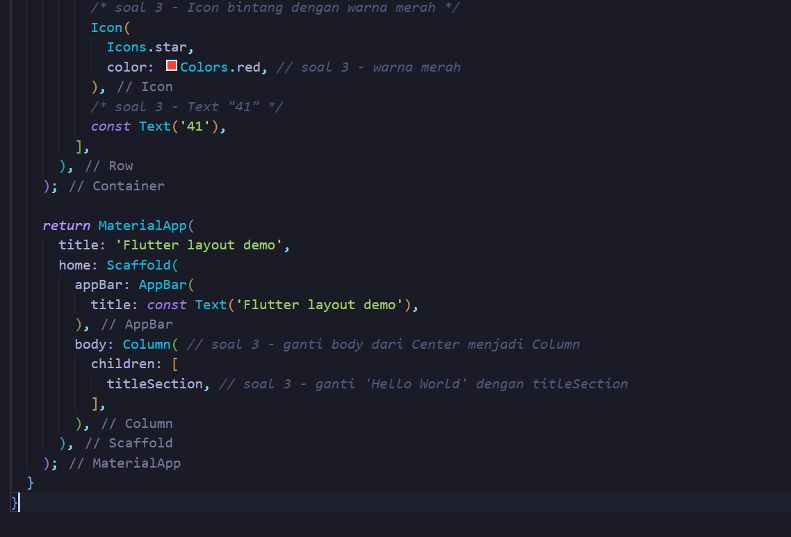

# 🏔️ Flutter Layout & Navigation - Jungfraujoch Explorer

**Nama:** Surya Rahmat Fatahillah  
**NIM:** 2341760020  
**Kelas:** SIB-3D

Aplikasi Flutter yang mendemonstrasikan implementasi layout dan navigasi dengan tema wisata Jungfraujoch, Switzerland. Proyek ini dibuat sebagai tugas praktikum mobile programming dengan fokus pada pemahaman widget layout Flutter.

## 📱 Screenshots & Progress

### 0. Initial Setup & Project Structure

**Tahap awal pembuatan project Flutter dengan struktur folder yang lengkap dan konfigurasi dasar aplikasi.**

### 1. Basic Layout Implementation

**Implementasi layout dasar dengan AppBar sederhana dan struktur widget fundamental Flutter.**

### 2. Title Section Development

**Pengembangan section judul dengan implementasi Row, Column, dan text styling untuk menampilkan informasi wisata.**

### 3. Button Section Creation

**Pembuatan section tombol dengan tiga action buttons (CALL, ROUTE, SHARE) menggunakan method _buildButtonColumn yang reusable.**

### 4. Text Section Integration

**Integrasi text section dengan Container, padding, dan softWrap untuk menampilkan deskripsi lengkap destinasi wisata.**

### 5. Layout Enhancement

**Penyempurnaan layout dengan perbaikan spacing, alignment, dan visual hierarchy untuk user experience yang lebih baik.**

### 6. Styling & Theming

**Penerapan styling dan theming dengan color scheme yang konsisten, typography yang readable, dan visual elements yang menarik.**

### 7. Image Integration

**Integrasi gambar hero dengan assets management dan proper image handling untuk menampilkan foto destinasi wisata.**

### 8. Modern UI Implementation

**Implementasi modern UI dengan Material 3 design system, card-based layout, shadows, dan rounded corners untuk tampilan yang lebih profesional.**

### 9. Final Application

**Hasil akhir aplikasi dengan semua fitur terintegrasi, scrollable layout, dan design yang responsive serta user-friendly.**

## ✨ Fitur Utama

- 🖼️ **Hero Image Section** - Gambar utama destinasi dengan gradient overlay
- 📋 **Title Section** - Informasi nama dan lokasi wisata dengan rating
- 🔘 **Action Buttons** - Tombol CALL, ROUTE, dan SHARE dengan touch feedback
- 📖 **Description Section** - Deskripsi lengkap tentang destinasi wisata
- 🎨 **Modern UI/UX** - Material 3 design dengan card-based layout
- 📱 **Responsive Design** - Layout yang adaptif untuk berbagai ukuran layar

## 📚 Konsep Flutter yang Dipelajari

### Layout Widgets
- **Container** - Untuk styling dan positioning
- **Row & Column** - Untuk arrangement horizontal dan vertikal
- **Expanded** - Untuk responsive sizing
- **Padding** - Untuk spacing management

### UI Components
- **AppBar** - Navigation bar dengan title
- **Scaffold** - Basic app structure
- **Text** - Typography dengan styling
- **Icon** - Visual elements dan indicators

### Design Principles
- **Material Design** - Konsistensi visual dan UX
- **Color Theory** - Pemilihan warna yang harmonis
- **Typography** - Hierarchy dan readability
- **Spacing** - Layout yang seimbang dan breathing room

